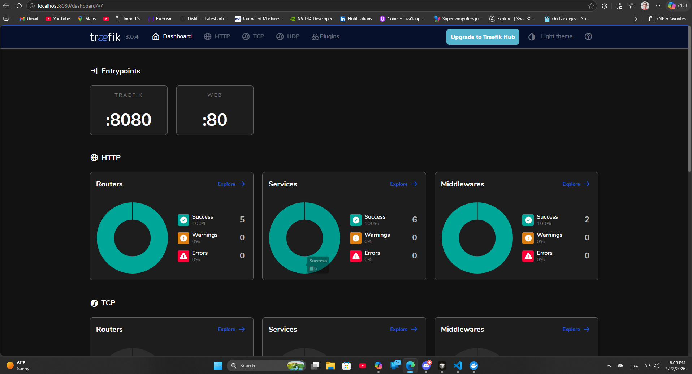

# MicroCity — Observabilite & Conteneurisation Avancee



> **Mission** : generer un projet complet nomme MicroCity, un systeme distribue
> conteneurise concu pour apprendre la conteneurisation avancee, le networking Docker,
> et l'observabilite moderne.

---

## Objectif

Produire un projet structure, pedagogique, reproductible, contenant :

- un `docker-compose.yaml` multi-services
- plusieurs reseaux Docker (`frontend-net`, `backend-net`, `observability-net`)
- 6 services conteneurises :
  - `gateway` (Traefik)
  - `api-users` (FastAPI)
  - `api-orders` (Go)
  - `db` (PostgreSQL)
  - `queue` (RabbitMQ)
  - `worker` (Python)
- instrumentation OpenTelemetry (traces, logs, metriques)
- exporters Prometheus
- scripts de test de charge
- documentation claire et progressive

---

## Structure attendue

```
microcity/
+-- docker-compose.yaml
+-- gateway/
|   +-- traefik.toml
+-- api-users/
|   +-- app.py
|   +-- Dockerfile
+-- api-orders/
|   +-- main.go
|   +-- Dockerfile
+-- worker/
|   +-- worker.py
|   +-- Dockerfile
+-- observability/
|   +-- prometheus.yaml
+-- scripts/
|   +-- load_test.sh
+-- docs/
|   +-- architecture.md
|   +-- networking.md
|   +-- observability.md
+-- README.md
```

---

## Networking

Creer 3 reseaux isoles :

| Reseau              | Driver         | Role                               |
|---------------------|----------------|------------------------------------|
| `frontend-net`      | bridge         | Gateway <-> services API           |
| `backend-net`       | bridge         | Services API <-> DB, queue, worker |
| `observability-net` | bridge         | Tous services <-> stack metriques  |

Chaque service est attache **uniquement** aux reseaux pertinents.

---

## Observabilite

Inclure :

- Instrumentation OpenTelemetry dans `api-users`, `api-orders`, `worker`
- Traces distribuees : `gateway -> services -> DB`
- Metriques : latence, throughput, erreurs, queue depth
- Logs structures (JSON)
- Dashboard Prometheus + Grafana

---

## Tests

Inclure :

- `load_test.sh` : bombardement HTTP avec curl / wrk / vegeta
- Scenario de panne : latence artificielle + restart de conteneur

---

## Documentation

Fichiers Markdown a produire :

- `architecture.md` -- vue globale du systeme
- `networking.md`   -- modele reseau Docker explique
- `observability.md` -- stack d'observabilite et lecture des signaux
